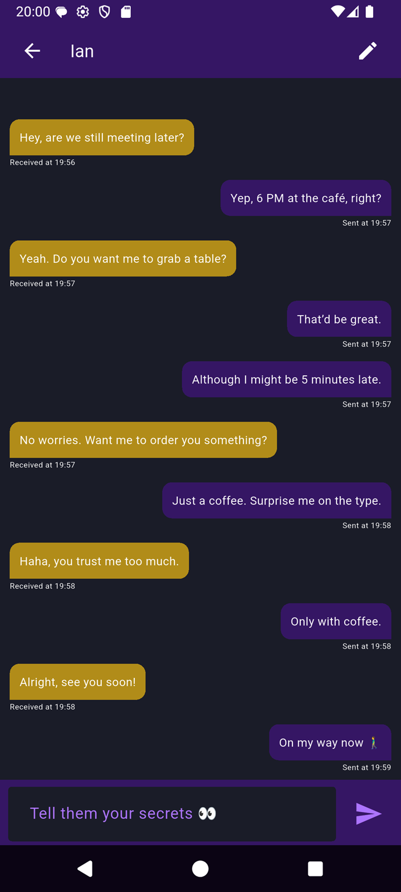
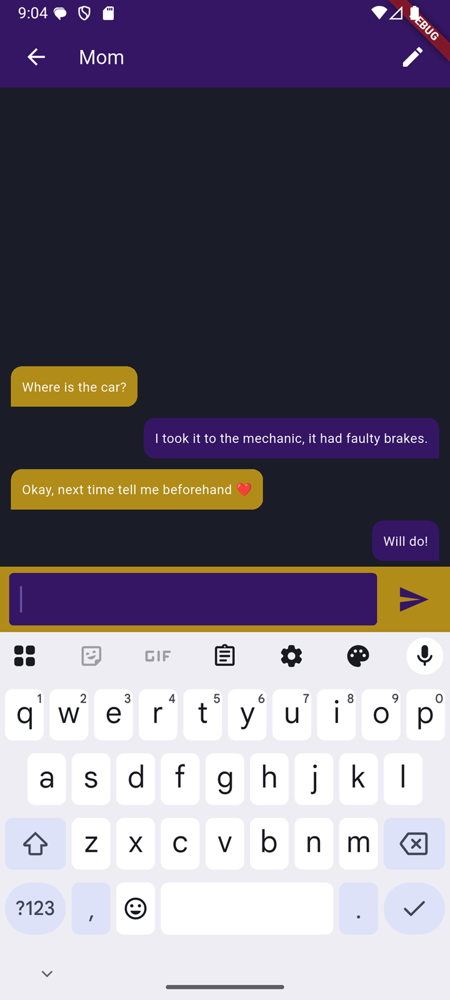
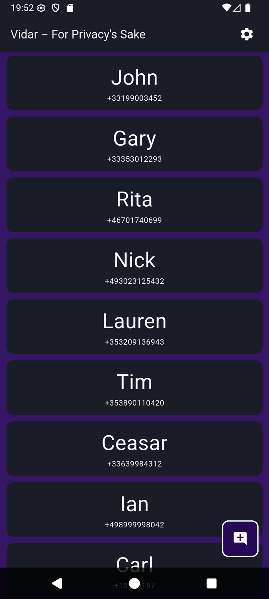
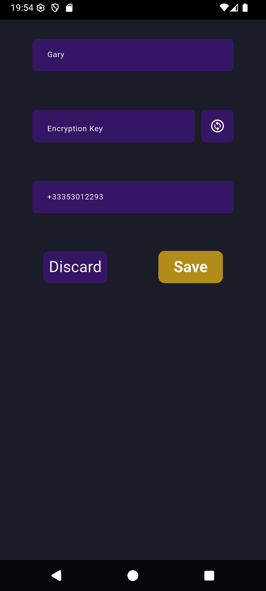

# Vidar 0.1.0
An sms application utilizing AES256 encryption to keep your private messages private.
Why? Because privacy is a human right and it should be respected.

If you have any questions feel free to ask!

  

## Screenshots

 

 

 

